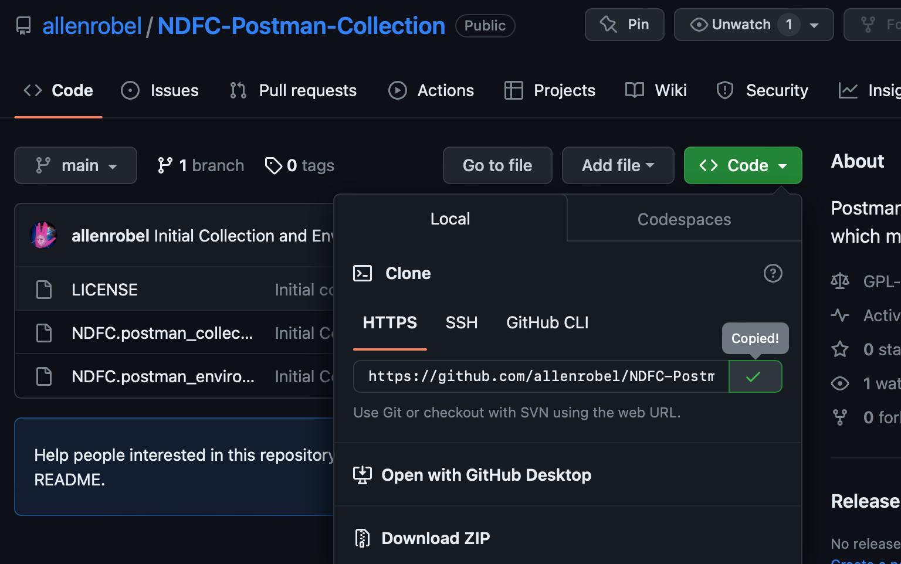
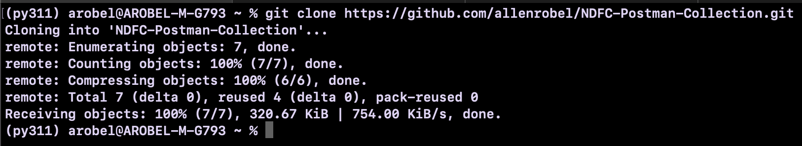
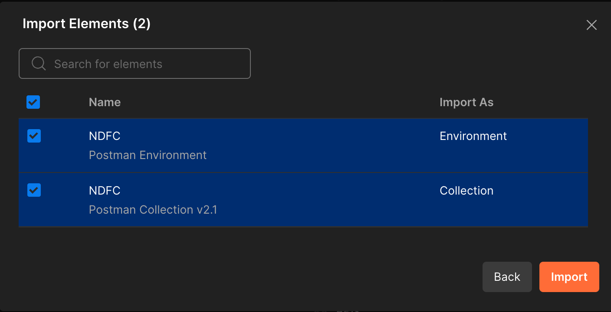

# NDFC-Postman-Collection

## About

This repository contains a Postman Collection and Environment which mirrors the NDFC REST API.

## Installation and Usage

## 1. Clone this repository

### 1a. Copy Repository URL

### 1b. Clone the respository using your favorite git client

## 2. Download Postman 

https://www.postman.com/downloads/

## 3. Import the Collection

### 3a. File -> Import

### 3b. In the import dialog, click on folders in the sentence "Or select files or folders" (or drag and drop the folder to the dialog)

### 3c. In the next dialog, click Import

## 4. Edit the imported Environment to match your local environment (e.g. ndfc_host, base_url, ndfc_username, ndfc_password, etc)

## 5. Select the Environment in Postman (top-right corner of the UI)

## 6. Try the Login REST POST request

You should receive back a token from the NDFC controller which will last until the token times out, at which point you'll need to execute the Login request again.

At this point, the other REST endpoints should work (assuming you've edited the corresponding variables in the Environment)